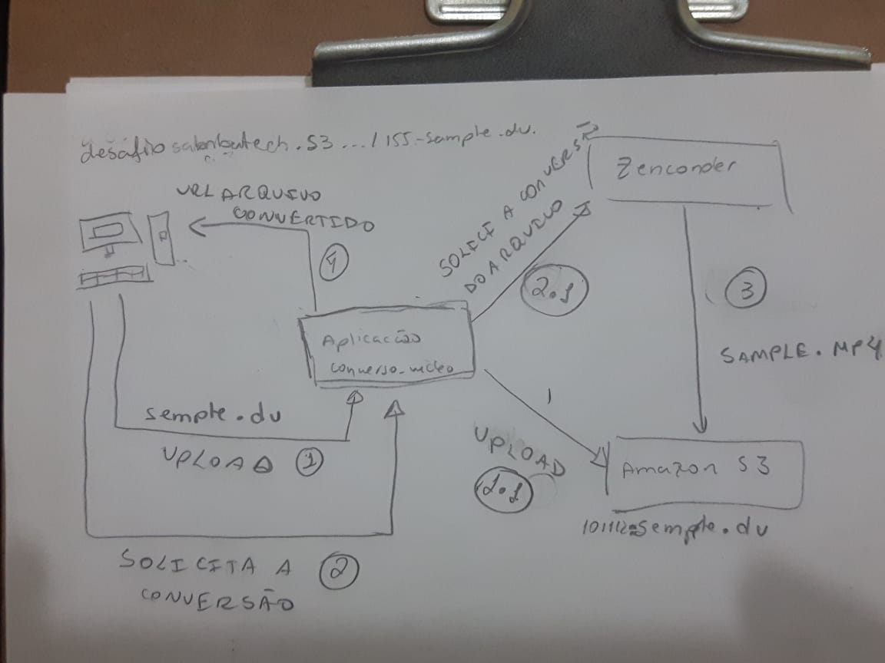

# Conversor de video 

Aplicação web que possibilita a conversão de arquivos de video de um formato específico, 
não compatível com padrões da web, para um formato que seja compatível com os padrão da web.

## Tecnologias utilizadas

 - Frontend 
    * React js: Framework para construção da tela 
    * ES6 
 - Backend 
    * Spring boot: Framework para base para estruturação de todo backend 
    https://spring.io/projects/spring-boot
    * Okhttp3 :  Client  HTTP & HTTP/2 para fazer comunicação com api Zencoder https://github.com/square/okhttp : 
    * Zencoder  : Serviço de econding de aquivos http://zencoder.com http://zencoder.com
    * Amazon S3: serviço de armazenamento de arquivos em cloud . 
    
 ## Deploy
O deploy da aplicação foi feito na instancia Amazon EC2 e pode ser acessado pelo link 
http://ec2-18-222-221-117.us-east-2.compute.amazonaws.com:8080/ 

 ## Arquitetura
 
 
 1 - O usuário faz o upload do arquivo pela aplicação 
    nesse momento é gerado um nome para  arquivo  antes de submetelo ao amazon s3, com seguinte padrão <DataHoraMinutoMilisegundosMilesimosSeg>-NomeDoArquivoSubmetido.<ExtensãoOriginalDoArquivo> 
   
 1.1 - A aplicação submete o arquivo do usuário para o amazon s3 
 
 2 - Assim que o arquivo é feito o upload do arquivo o usuário tem acesso as opções de conversão. 
 Nesse momento ele escolhe um formato de saída e solicita a conversão do arquvo 
 
 2.1 - A aplicação faz comunicação com Zencoder API para que ela faça a conversão do arquivo .
 
 3 -  Um dos parâmetros que podem  ser passado para a API Zenconder é a url do bucket na amazon s3 onde ele fará o  upload do resultado final 
      essa configuração pode ser vista no arquivo application.properties 

 4 - Assim que o arquivo é convertido o usuário pode acessar a url do arquivo e visualiza-lo browser. 
    Obs: Zencoder API retorna a URL com resultado da converão antes de disponibilar completamente o arquivo de saída no amazon s3
    O que pode levar o usuário a ver uma mensagem de access denied ao acessar a url do arquivo de saída 
    a aplicação não fez esse tratamento para a esperar até o upload do arquivo de saída no amazon s3 esteja concluído. 
    
    
 
    
 

 
